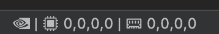
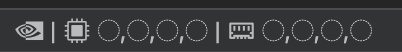
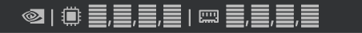
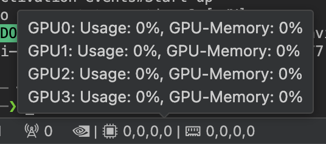

# Nvidia Status Bar

Elegantly display **NVIDIA** and **AMD** GPU utilisation and real memory consumption rate in vscode status bar.

## Compact Status Bar
Display the tens digit of the occupancy rate, or use icons such as bar and pie.

## Detailed Hover Window

## Real Memory Occupation

The GPU memory occupation rates are calculated by dividing `memory.used` by `memory.total` not directly import from `utilization.memory`. Since `utilization.memory` refers to the active memory (currently being read or written).

## Styles

* circle `◌◔◑◕◍`
* bar `▁▂▃▄▅▆▇█`
* recycle `♺♳♴♵♶♷♸♹`
* die `⛶⚀⚁⚂⚃⚄⚅`
* clock `🕛🕐🕑🕒🕓🕔🕕🕖🕗🕘🕙🕚`
* line `⎽⎼⎻⎺`
* pile `𝄖𝄗𝄘𝄙𝄚𝄛`
* digit `0123456789`
* circledigit `🄋➀➁➂➃➄➅➆➇➈`
* negativecircledigit `🄌➊➋➌➍➎➏➐➑➒`
* wan `🀆🀈🀉🀊🀋🀌🀍🀎🀏`
* tiao `🀆🀐🀑🀒🀓🀔🀕🀖🀗🀘`
* bing `🀆🀙🀚🀛🀜🀝🀞🀟🀠🀡`

## Acknowledgment
Nvidia Status Bar was based on or inspired by these projects:
* [innerlee/nvidia-smi](https://github.com/innerlee/nvidia-smi)
* [nvidia-smi-memory](https://github.com/yohan-pg/nvidia-smi-memory)